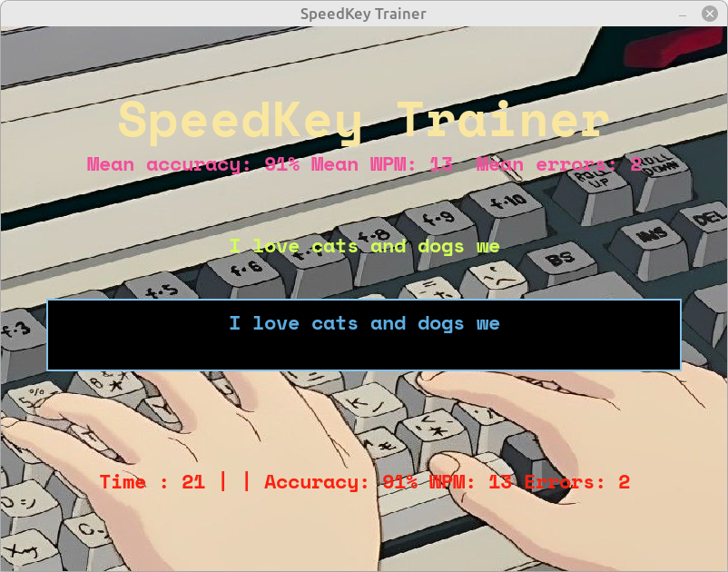
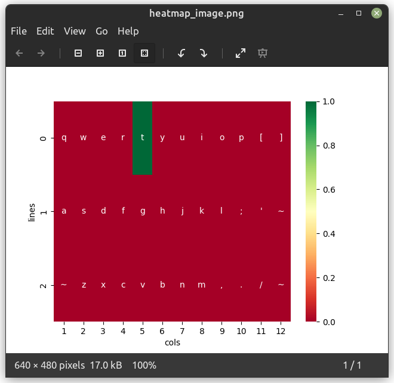

# SpeedKey Trainer

SpeedKey Trainer is a keyboard trainer designed to improve touch typing skills. It provides an interactive environment to practice typing with real-world content, preventing incorrect inputs and offering real-time feedback on errors, print speed, and more.

## Preparation

Before running SpeedKey Trainer, make sure to place your desired text in a file named `text.txt`.

## Functionality

- **Interface**: A simple interface with a line of text to be typed and an input field, preventing the input of incorrect characters.
- **Error Counting and Print Speed**: Tracks the number of errors made during typing sessions and displays the print speed in real-time.
- **Statistics Persistence**: Saves and retrieves training statistics between different runs.
- **GUI**: A graphical user interface that displays statistics while printing.
- **Mistake Heatmap**: Compiles a heatmap of the keys on which the user most often makes mistakes.

## How to Run

1. Install the required dependencies using the following command:

   ```bash
   pip install -r requirements.txt
   ```
2. Run the SpeedKey Trainer with the following command:

   ```python
   python3 main.py
   ```
## Screenshot of menu


## Screenshot of heatmap



